# 🗺️ Library Chaos - Browser Engine Plan

This map outlines the architecture specifically for a pure browser-based implementation without any 3rd-party engines (like Godot or Unity). It relies entirely on Vanilla JavaScript, HTML5 Canvas, and CSS.

```mermaid
graph TD
    %% Main Project
    Root["Library Chaos (Vanilla Web)"] --> Phase1["Phase 1: Engine Foundation"]
    Root --> Phase2["Phase 2: Core Mechanics"]
    Root --> Phase3["Phase 3: Entity AI"]
    Root --> Phase4["Phase 4: Progression & Loop"]

    %% Phase 1
    Phase1 --> P1A["HTML5 Canvas Setup"]
    Phase1 --> P1B["Custom Game Loop (requestAnimationFrame)"]
    Phase1 --> P1C["Input Manager (WASD/Mouse)"]

    %% Phase 2
    Phase2 --> P2A["Player Movement & Collision"]
    Phase2 --> P2B["Interactable Books (Floor & Carried)"]
    Phase2 --> P2C["Bookshelves (Return Zones)"]

    %% Phase 3
    Phase3 --> P3A["Kid NPCs (Roaming Logic)"]
    Phase3 --> P3B["Repulsion System (Fleeing Player)"]
    Phase3 --> P3C["Chaos Meter Tracking"]

    %% Phase 4
    Phase4 --> P4A["XP & Upgrade System"]
    Phase4 --> P4B["Dynamic Events (School Trips)"]
    Phase4 --> P4C["Win/Loss Conditions (30 Min Timer)"]
```

## High-Level Summary of the Engine-less Approach:
1. **Rendering:** Everything is drawn directly to a `<canvas>` element using the native `2D Context`.
2. **State Management:** A custom game loop calculates `deltaTime` to ensure smooth movement, regardless of the monitor's refresh rate.
3. **UI/HUD:** The Chaos Meter, Upgrade screens, and Game Over messages are handled via standard HTML/CSS placed directly over the canvas using a glassmorphism aesthetic.
